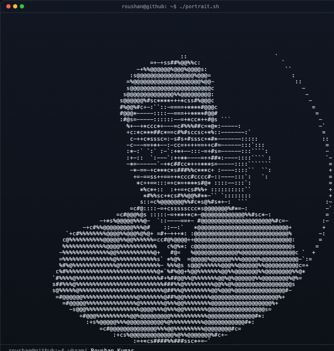

<!-- 🏁 Custom Banner -->

  

<h1 align="center">Hi 👋, I'm Abhijeet Mishra</h1>
<h3 align="center">Full-Stack Developer @ Lean Protocol &middot; Web3 &amp; Blockchain Builder</h3>

  <a href="https://portfolio-gamma-coral-23.vercel.app/">Portfolio</a> ·
  <a href="https://www.linkedin.com/in/abhijeet-mishra-abhi2104/">LinkedIn</a> ·
  <a href="https://x.com/AbhijeetMi53781">X / Twitter</a> ·
  <a href="https://www.instagram.com/m.abhi.05">Instagram</a> ·
  <a href="mailto:abhijeetmishra2104@gmail.com">Email</a>

<table>
<tr>
<td width="370" valign="top">
  
</td>
<td width="490" valign="top">
  
</td>
</tr>
</table>

  

Contribution graph refreshes daily via GitHub Actions — no token, no auth.

---

## 🚀 About Me

- 🎓 Pursuing B.Tech in Electronics and Communication Engineering at IIIT Bhagalpur with a CGPA of 8.93/10.00.
- 💻 Building a GLP-1 healthcare platform as a Full-Stack Developer at **Lean Protocol** — 4 production apps (React Native + Next.js) on a Node.js/TypeScript modular monolith.
- 💼 Also acting as Training and Placement Coordinator for Batch '27.
- 🌐 Experienced in Full-Stack Web Development, optimizing RESTful APIs, and achieving 99.9% backend uptime.
- 🔗 Passionate about Web3, building provably fair smart contracts with Solidity and Chainlink VRF v2.5.
- 📧 Reach me at: **abhijeetmishra2104@gmail.com**

---

## 💼 Experience

**Full-Stack Developer (Remote)** — Lean Protocol
Aug 2026 – Present
- Architected a GLP-1 obesity-management healthcare platform spanning 4 production apps — patient & physician React Native apps plus nutritionist and admin Next.js dashboards — on a Node.js/TypeScript modular-monolith backend, owning the full stack as 1 of 2 engineers.
- Modeled 6 longitudinal clinical domains in PostgreSQL (weight, medications, diet plans, lab reports, surveys, consultations), retaining 100% of historical records via immutable writes and audit logging to seed future risk-scoring models.
- Secured 4 role-based access tiers behind centralized auth, authorization and validation — medical documents on Cloudflare R2, Redis-cached sessions across all 4 clients.
- Consolidated the 4 apps into a single Turborepo/pnpm monorepo with shared types, validation schemas and API contracts, collapsing duplicated definitions to 1 source of truth and keeping 2 engineers shipping in parallel via Docker + GitHub Actions CI/CD.

**Training & Placement Coordinator** — Indian Institute of Information Technology, Bhagalpur
Jan 2025 – Present
- Orchestrated placement activities for 300+ students, streamlining recruitment workflows and communication — driving a 20% increase in placement rates and a 15% improvement in salary packages.

**Full-Stack Web Development Intern (Remote)** — Digital Prospects Consulting
May 2025 – Jul 2025
- Optimized REST API endpoints in Node.js and Express.js backed by MySQL with Redis caching, cutting average latency 45% and sustaining 99.9% uptime in production.
- Hardened release quality through peer code reviews and a defined Git branching strategy, resolving critical production crashes and reducing integration issues 15%.

**Student Mentor** — Adhyaay, IIIT Bhagalpur
Aug 2024 – Apr 2025
- Mentored 20+ students across academics, sports, and career development while leading a 6-member team that built the Adhyaay website — automating 50% of manual admin tasks and lifting student engagement by 30%.

---

## 🚀 Projects

**[InkSight](https://github.com/abhijeetmishra2104/InkSight) — AI Handwritten Exam Grader** Aug 2026 · [Live Demo](https://inksight-sand.vercel.app/)
- Built a four-stage vision pipeline (Next.js, TypeScript, Gemini) that extracts questions from a paper in printed order, reads a student's handwritten sheet, maps each answer to its question, then grades it with feedback.
- Localized answers at the **line** level rather than the block level — unions of line boxes yield tight highlights and multi-page spans for free — with box repair that clamps, un-inverts and drops degenerate regions so a highlight never lands in the wrong place.
- Ran a deterministic label pass (`Q7 (b)`, `11 (a)`, `Ans 3` → one canonical key) ahead of the model, pinning unambiguous markers as anchors the LLM may not contradict.

**[Sidekick AI](https://github.com/abhijeetmishra2104/sideKickAI) — Self-Evaluating Autonomous Agent** Aug 2026
- Built a LangGraph state machine pairing a Worker LLM with a separate Evaluator LLM that grades every response against a user-supplied success criterion and feeds structured feedback back into the worker until the task actually passes.
- Wired real tools — Playwright browser control, search, Python execution, file and Notion access — behind the worker, with `MemorySaver` checkpointing session state across turns.
- Bounded the loop with `MAX_ATTEMPTS` and a recursion limit so an unsatisfiable criterion fails fast instead of burning thousands of model calls.

**[VitalSense](https://github.com/abhijeetmishra2104/vitalSense) — Multi-Parameter Patient Vitals Monitor** Aug 2026
- Designed a thin-edge / smart-server split: an ESP32 handles timer-driven acquisition while streaming DSP (bandpass + notch + Pan-Tompkins QRS detection), vitals derivation and alarming run server-side in Node.js where they can be regression-tested.
- Validated against cardiologist-annotated MIT-BIH recordings replayed at true 360 Hz in the device's own frame format — 75 bpm against the record's 75.3 bpm reference — so the whole pipeline runs with no hardware attached.
- Shipped a Canvas dashboard and central station over WebSocket: beds ordered by worst active alarm, and a device that disappears stays on screen marked offline, because a vanishing tile looks exactly like a patient being fine.

**[Decentralized Stablecoin (DSC)](https://github.com/abhijeetmishra2104/Decentralized-Stablecoin) — Overcollateralized Algorithmic Stablecoin** Jul 2026
- Engineered a dollar-pegged, exogenously collateralized stablecoin in Solidity/Foundry — DAI without governance or fees — backed solely by WETH and WBTC.
- Built `DSCEngine` as the mint/redeem/deposit/withdraw core with a 200% liquidation threshold and a health-factor check that reverts any action breaking a user's collateralization.
- Priced collateral through Chainlink `AggregatorV3Interface` feeds, guarding state-changing paths with OpenZeppelin `ReentrancyGuard` and custom errors.

**[Industrial Credit Risk Assessment System](https://github.com/abhijeetmishra2104/credit-risk-analysis) — Explainable ML Credit Scoring** Jul 2026
- Built a scikit-learn loan-default model that converts predicted probability into a CIBIL-like credit score, then validates it against rule-based banking policy to produce a final lending decision.
- Made every decision auditable with SHAP waterfall explanations attributing the outcome to individual applicant features — the part that makes an ML credit model usable in a regulated setting.
- Shipped an interactive Streamlit dashboard with SQLite assessment history and generated PDF credit reports.

**[AsyncForge](https://github.com/abhijeetmishra2104/asyncForge) — Fault-Tolerant Event-Driven AI Task Processing System** Jul 2026 · [Live Demo](https://asyncforge.onrender.com/)
- Engineered a fault-tolerant, event-driven asynchronous backend (Next.js, TypeScript, RabbitMQ, PostgreSQL, Prisma) absorbing 500+ concurrent jobs and collapsing API response time from 12 s to 35 ms — a 340× speedup.
- Designed distributed Dispatcher and Worker microservices sustaining 150+ jobs/minute, using idempotent processing and RabbitMQ Publisher Confirms for reliable delivery across 2 service tiers.
- Implemented bounded retries and the Competing Consumers pattern, validated against 1,000+ simulated failures — throughput scales linearly with each added worker.
- Containerized every service with Docker on a local Kubernetes (kind) cluster with health checks and Prometheus/Grafana observability, cutting batch execution time 66%.

**ERC-721 NFT Implementations** Jul 2026
- Deployed two NFT architectures in Solidity/Foundry — one with IPFS off-chain metadata, one fully on-chain with dynamic, Base64-encoded SVG metadata.
- Built a dynamic Mood NFT with mutable on-chain state, letting the metadata and artwork flip between Happy and Sad via contract calls.
- Explored EVM-level encoding (`abi.encode`, `abi.decode`, `abi.encodePacked`, function selectors, calldata, low-level calls) on Anvil and Sepolia.

**ERC-20 From Scratch** Jul 2026
- Implemented a simplified ERC-20 token in Solidity — balances, transfers, supply tracking, decimals — to internalize the EIP-20 spec.
- Automated build/test/deploy with a Foundry + Makefile workflow; deployed and verified on Sepolia via Etherscan.

**Provably Fair Smart Contract Lottery** Jun 2026
- Engineered a decentralized lottery in Solidity + Chainlink VRF v2.5 with cryptographically secure, autonomous winner selection.
- Built a Foundry test suite (unit, stress, gas benchmarks) validated under 1,000+ concurrent users; cut transaction costs 18% via gas optimization.

**[SonicScribe](https://github.com/abhijeetmishra2104/SonicScribe) — Full-Stack Audio Intelligence Platform (LLM/NLP)** Jun 2025 · [Live Demo](https://sonicscribe-web.vercel.app)
- Delivered a production-ready medical audio analysis platform (Next.js frontend, Python Flask REST backend) integrating OpenAI Whisper API and LangChain to process 1,000+ audio files at 95% reliability.
- Streamlined secure REST APIs for direct file uploads and Cloudinary URLs with PostgreSQL persistence, cutting backend crashes 40% and improving data processing speed 25%.
- Automated zero-touch CI/CD across 2 environments (Heroku backend, Vercel frontend) with GitHub Actions, reducing manual deployment time 90%.
- Migrated large model assets out of the Dockerized Flask image to external storage, eliminating 100% of build failures and improving deployment portability.

**Medium — Feature-Rich Blogging Platform** Sep 2024
- Built a full-stack blogging app (React, TypeScript, Tailwind) with JWT auth, deployed frontend on Vercel + backend on Cloudflare Workers at 99.9% uptime.
- Published a reusable npm package standardizing input validation across modules, cutting validation errors by 30%.

---

## 🧰 Tech Arsenal

  

Languages

  

Frontend

  
  
  
  

Backend

  

Databases

  
  
  

DevOps / Cloud

  
  
  

Messaging & Observability

  
  
  
  

Web3 / Blockchain tooling

  
  
  
  
  

APIs / Realtime

  
  
  
  
  
  
  

---

## 🏅 Achievements

- 🧩 Solved **500+ Data Structures & Algorithms problems** in C++ — [Codolio profile](https://codolio.com/profile/abhijeetmishra).
- 🥉 Placed **5th at Jaipur Cybrathon 2026** — top 10% of the field.
- 🏫 **Top-15** at IIIT Bhagalpur's Smart India Hackathon internal round.
- 🎓 **Training & Placement Coordinator, Batch '27** — coordinated placements for 300+ students, driving a 20% increase in placement rate and a 15% improvement in average package.
- 🧑‍🏫 **Student Mentor & Web Team Lead, Adhyaay** — led a 6-member team and mentored 20+ students, cutting administrative effort 50% and lifting engagement 30%.

---

## 📜 Certifications

- 🏆 **[ServiceNow Certified System Administrator (CSA)](https://www.credly.com/badges/55e500b4-1c0f-4655-9417-e4cf9c886c44/linked_in_profile)** — ServiceNow
- 🏆 **[Certified Application Developer (CAD)](https://www.credly.com/badges/f188e150-137c-4442-8c2f-9c0fa832ac00/linked_in_profile)** — ServiceNow
- ⛓️ **[Foundry Fundamentals](https://profiles.cyfrin.io/u/abhijeetmishra2104/achievements/foundry)** — Cyfrin Updraft
- ⛓️ **[Solidity Smart Contract Development](https://profiles.cyfrin.io/u/abhijeetmishra2104/achievements/solidity)** — Cyfrin Updraft
- ⛓️ **[Blockchain Basics](https://profiles.cyfrin.io/u/abhijeetmishra2104/achievements/blockchain-basics)** — Cyfrin Updraft
- 💻 **[Full-Stack Developer](https://drive.google.com/file/d/1VpmOTUYDzYc5uIiUp6V6aMtG8q1DeGJo/view)** — 100xdevs
- 🤖 **[Introduction to Large Language Models](https://drive.google.com/file/d/1LDuytZZwxxQOKRpNKw3ZAMuQs3VM6vBn/view)**
- 🔒 **[Introduction to Cybersecurity](https://drive.google.com/file/d/1mmb4kZmCirU6IDLLtnATX9gU-4EgESXX/view)**